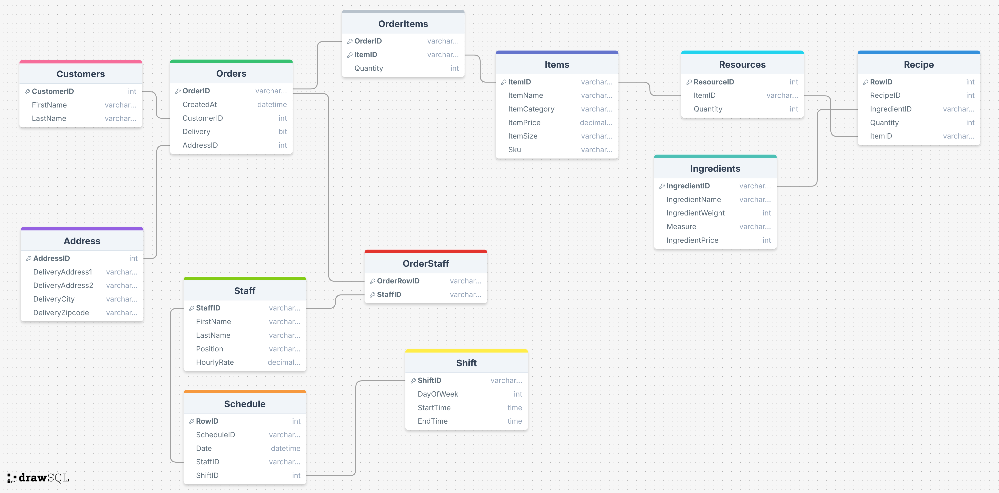

# Pizzeria Management Database

A full-featured SQL-based database system for managing a pizzeria's operations — from order tracking to staff scheduling and ingredient costing.

---

## Project Overview

This project simulates a real-world pizzeria backend system using SQL. It demonstrates:
- Order processing and tracking
- Ingredient and stock management
- Staff scheduling and wage costing
- Total cost computation (ingredient + labor + delivery)
- Relational schema with proper normalization and foreign key constraints

---

## Features

- **Orders & Deliveries**: Tracks customer orders and delivery info
- **Staff Management**: Handles staff shifts, roles, and wages
- **Menu Items & Ingredients**: Manages pizzas and their recipes
- **Cost Calculation**: Calculates total cost of making and delivering an order
- **SKU & Inventory**: Adds SKU (unique product codes) and size info for items, and manages stock via the `Resources` table

---

## Database Schema

The schema is fully normalized and structured for data integrity and scalability.



---

## Tech Stack

- SQL Server
- ERD created using [drawSQL](https://drawsql.app)
- SQL features used:
  - `JOIN`, `WITH`, `CASE`, `DATEDIFF`, `GROUP BY`
  - Constraints: `PRIMARY KEY`, `FOREIGN KEY`, `NOT NULL`

---

## Project Structure

| File | Description |
|------|-------------|
| `CreateTables.sql` | Creates all tables with relationships |
| `AlterTables.sql` | Adds missing constraints, keys, and fields |
| `SampleData.sql` | Seeds the database with realistic sample data |
| `ComputeTotalCost.sql` | Calculates the total cost of a specific order |

---

## How to Run the Project

### 2. Run Scripts in Order
1. `CreateTables.sql`
2. `AlterTables.sql`
3. `SampleData.sql`

### 3. Query Example – Calculate Total Cost of an Order

Use the script:

```sql
-- Run ComputeTotalCost.sql

